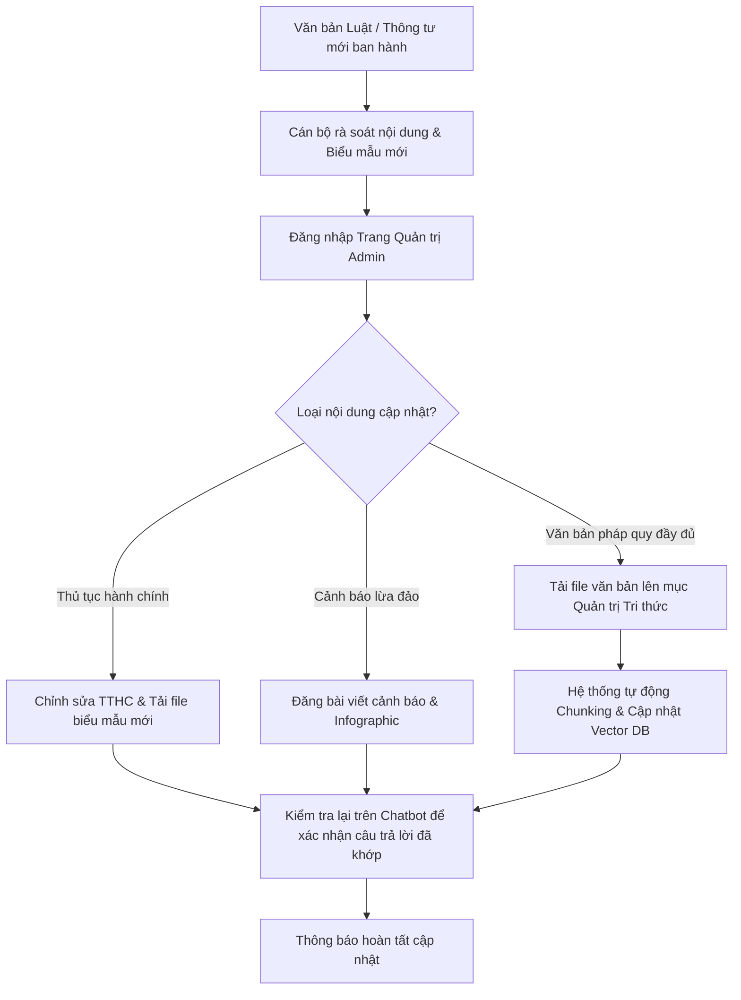

# QUY TẮC PHÁT TRIỂN & BẢO TRÌ DỰ ÁN
## DỰ ÁN: TRỢ LÝ PHÁP LUẬT VÀ THỦ TỤC HÀNH CHÍNH (CÔNG AN XÃ ĐỨC HỢP)

---

## 1. NGUYÊN TẮC CỐT LÕI (CORE PRINCIPLES)

Mọi thành viên tham gia phát triển, bảo trì và vận hành hệ thống phải tuân thủ nghiêm ngặt 4 nguyên tắc nền tảng sau:

1. **Tính Chuẩn xác Pháp lý Tuyệt đối (Absolute Legal Accuracy):**
   - Đây là ứng dụng định hướng phục vụ công tác của lực lượng Công an nhân dân cơ sở. Mọi thông tin về thủ tục hành chính, thành phần hồ sơ, mức phí, thẩm quyền giải quyết và thời hạn trả kết quả phải căn cứ chính xác vào văn bản quy phạm pháp luật hiện hành và hướng dẫn nghiệp vụ của Bộ Công an.
   - Tuyệt đối không để AI suy đoán bừa bãi hoặc cung cấp thông tin sai lệch về quy trình thủ tục của nhà nước.

2. **Bảo mật và Quyền Riêng tư Công dân (Zero PII - Privacy First):**
   - Không lưu trữ dữ liệu cá nhân nhạy cảm của người dân (như số CCCD, hình ảnh chân dung, số tài khoản ngân hàng, thông tin cư trú cụ thể) vào cơ sở dữ liệu nhật ký hệ thống.
   - Toàn bộ phiên hỏi đáp của người dân được xử lý ẩn danh. Dữ liệu câu hỏi chỉ dùng để phân tích xu hướng quan tâm của xã hội nhằm phục vụ công tác tuyên truyền.

3. **Thiết kế Lấy Người Dân Làm Trung Tâm (Citizen-Centric UX):**
   - Giao diện phải được thiết kế theo tư duy **Mobile-First**, tối ưu hoàn hảo cho việc mở từ mã QR Code qua ứng dụng Zalo, Camera điện thoại hoặc trình duyệt di động.
   - Cỡ chữ to rõ ràng, màu sắc trang nhã, tương phản tốt, ngôn từ giải thích giản dị, gần gũi với bà con nhân dân.

4. **Kiến trúc Bền vững và Dễ Chuyển giao (Maintainability & Extensibility):**
   - Mã nguồn phải rõ ràng, có tài liệu hướng dẫn đầy đủ để cán bộ phụ trách CNTT của Công an xã hoặc đơn vị tiếp nhận có thể dễ dàng quản trị, cấu hình và cập nhật dữ liệu mà không cần can thiệp sâu vào mã nguồn lập trình.

---

## 2. QUY CHUẨN LẬP TRÌNH (CODING STANDARDS)

### 2.1. Quy chuẩn Frontend (Next.js & TypeScript)
- **Ngôn ngữ:** TypeScript ở chế độ nghiêm ngặt (`"strict": true`). Tuyệt đối không dùng kiểu `any` tùy tiện; phải định nghĩa `interface` hoặc `type` rõ ràng cho các thực thể (`Procedure`, `Article`, `ChatMessage`, `UserFeedback`).
- **Giao diện (Tailwind CSS):**
  - Tuân thủ hệ màu thống nhất: Màu chủ đạo xanh Công an nhân dân (`#005A9E` / `#0B3C5D`), màu đỏ sao vàng làm điểm nhấn, nền trung tính sáng rõ.
  - Hỗ trợ đầy đủ Responsive Design từ màn hình nhỏ nhất (360px) đến máy tính bảng và màn hình lớn.
  - Sử dụng bộ biểu tượng nhất quán từ thư viện `lucide-react`.
- **Tối ưu hiệu năng:**
  - Sử dụng Server Components cho các trang nội dung tĩnh để tối đa hóa tốc độ tải trang.
  - Sử dụng Client Components (`'use client'`) chỉ ở những nơi thực sự cần tương tác như Hộp thoại Chat, Tìm kiếm trực tiếp, Form biểu mẫu.
  - Áp dụng Server-Sent Events (SSE) để tạo hiệu ứng gõ chữ thời gian thực (Streaming) mượt mà cho Trợ lý AI.

### 2.2. Quy chuẩn Backend (Python & FastAPI)
- **Chuẩn mã nguồn:** Tuân thủ triệt để PEP 8. Đặt tên biến, hàm theo quy tắc `snake_case`, tên lớp theo `CamelCase`.
- **Xác thực dữ liệu:** Toàn bộ dữ liệu vào/ra API phải được định nghĩa bằng Schema của `pydantic` (Pydantic v2).
- **Xử lý bất đồng bộ:** Sử dụng `async/await` cho toàn bộ các thao tác I/O (gọi CSDL, gọi Vector DB, gọi API AI, đọc ghi file).
- **Quản lý lỗi tập trung (Exception Handling):**
  - Mọi lỗi nghiệp vụ phải trả về mã HTTP Status Code chuẩn (400, 401, 403, 404, 500) kèm cấu trúc JSON lỗi thống nhất:
    ```json
    {
      "success": false,
      "error_code": "PROCEDURE_NOT_FOUND",
      "message": "Không tìm thấy thủ tục hành chính yêu cầu.",
      "detail": null
    }
    ```
- **Tách biệt các tầng:**
  - `routers/`: Định nghĩa Endpoint và điều hướng HTTP.
  - `services/`: Chứa toàn bộ Business Logic nghiệp vụ và xử lý dữ liệu.
  - `models/`: Định nghĩa thực thể CSDL (SQLAlchemy ORM).
  - `schemas/`: Định nghĩa Pydantic DTO (Request/Response).
  - `core/`: Chứa cấu hình bảo mật, kết nối DB, biến môi trường (`config.py`).

### 2.3. Quy chuẩn Dành riêng cho Module AI & RAG
- **Ngăn chặn Bịa đặt (Hallucination Control):**
  - Cấu hình nhiệt độ sinh văn bản (`temperature`) ở mức thấp ($\le 0.2$) để AI phản hồi dựa trên thực tế, hạn chế tối đa việc sáng tạo ngoài dữ liệu cung cấp.
  - Trong System Prompt, bắt buộc có mệnh lệnh: *"Nếu thông tin người dân hỏi không có trong tài liệu quy định được cung cấp, hãy lịch sự thông báo chưa có dữ liệu và hướng dẫn người dân liên hệ trực ban Công an xã Đức Hợp qua số điện thoại đường dây nóng."*
- **Hàng rào an toàn (Safety Guardrails):**
  - Từ chối trả lời ngay lập tức đối với các câu hỏi hướng dẫn hành vi vi phạm pháp luật, lách luật, trốn tránh trách nhiệm pháp lý.
  - Lọc bỏ các từ ngữ thô tục, xúc phạm hoặc cố tình tấn công Prompt Injection.
- **Tuyên bố miễn trừ trách nhiệm (Disclaimer):**
  - Mọi câu trả lời của AI trên giao diện đều phải có dòng chữ thông báo tự động: *"Thông tin do Trợ lý AI cung cấp mang tính chất hướng dẫn và tham khảo. Khi thực hiện thủ tục, kính mời công dân mang giấy tờ đến Trụ sở Công an xã Đức Hợp hoặc truy cập Cổng Dịch vụ công chính thức."*

---

## 3. QUY TRÌNH QUẢN LÝ MÃ NGUỒN & PHIÊN BẢN (GIT WORKFLOW)

- **Chiến lược nhánh (Branching Strategy):**
  - `main`: Nhánh ổn định cao nhất, chỉ chứa mã nguồn đã kiểm thử sẵn sàng triển khai trên môi trường thật (Production).
  - `develop`: Nhánh tích hợp các tính năng mới trước khi phát hành.
  - `feature/<tên-tính-năng>`: Nhánh phát triển tính năng mới (ví dụ: `feature/rag-pipeline`, `feature/scam-alert-ui`).
  - `hotfix/<tên-lỗi>`: Nhánh sửa lỗi khẩn cấp trực tiếp từ `main`.
- **Quy tắc Commit (Conventional Commits):**
  - `feat: <nội dung>`: Thêm tính năng mới.
  - `fix: <nội dung>`: Sửa lỗi.
  - `docs: <nội dung>`: Cập nhật tài liệu kỹ thuật, hướng dẫn.
  - `refactor: <nội dung>`: Tái cấu trúc mã nguồn không làm thay đổi hành vi.
  - `chore: <nội dung>`: Cập nhật thư viện phụ thuộc, cấu hình Docker, script build.

---

## 4. QUY TRÌNH BẢO TRÌ & CẬP NHẬT DỮ LIỆU PHÁP LÝ (DATA LIFECYCLE)

Để hệ thống luôn phản ánh chính xác các quy định mới nhất của Nhà nước và Bộ Công an, quy trình bảo trì dữ liệu được quy định như sau:



### Thời hạn rà soát định kỳ:
- **Hàng tuần:** Cán bộ Công an xã cập nhật các tin tức cảnh báo thủ đoạn lừa đảo mới nổi trên địa bàn hoặc trên không gian mạng.
- **Hàng tháng / Khi có văn bản mới:** Rà soát lại danh mục thủ tục hành chính, mức thu lệ phí và đường dẫn liên kết đến Cổng Dịch vụ công Quốc gia.
- **Hàng quý:** Đánh giá các câu hỏi người dân hay hỏi nhất nhưng AI chưa có dữ liệu để bổ sung kịp thời vào kho tri thức.

---

## 5. QUY TRÌNH VẬN HÀNH, SAO LƯU & AN TOÀN HỆ THỐNG (OPERATIONS & DEVOPS)

1. **Sao lưu dữ liệu định kỳ (Automated Backup):**
   - Cơ sở dữ liệu PostgreSQL và thư mục tài liệu biểu mẫu phải được sao lưu tự động hàng ngày (Daily Cronjob) vào lúc 02:00 sáng.
   - Giữ lại bản sao lưu của 30 ngày gần nhất tại máy chủ và 01 bản lưu trữ đám mây tách biệt.
2. **Giám sát hệ thống (Health Check & Monitoring):**
   - Cung cấp endpoint kiểm tra trạng thái hoạt động: `GET /api/health` trả về trạng thái của CSDL, Vector DB và kết nối AI API.
   - Cấu hình Docker tự động khởi động lại container khi có lỗi (`restart: unless-stopped`).
3. **Ứng phó sự cố (Incident Response Plan):**
   - *Trường hợp 1: Mất kết nối API AI (Gemini/OpenAI)* $\rightarrow$ Hệ thống tự động chuyển sang chế độ dự phòng (Fallback Mode): Tắt khung chat AI thông minh, hiển thị thông báo "Trợ lý AI đang bảo trì" và hướng dẫn người dân sử dụng thanh tìm kiếm TTHC truyền thống kèm số điện thoại Trực ban Công an xã.
   - *Trường hợp 2: Lỗi cơ sở dữ liệu* $\rightarrow$ Nginx trả về trang thông báo thân thiện và tự động gửi cảnh báo cho quản trị viên.
