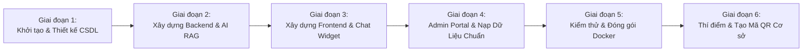

# KẾ HOẠCH TRIỂN KHAI DỰ ÁN (PROJECT IMPLEMENTATION PLAN)
## DỰ ÁN: TRỢ LÝ PHÁP LUẬT VÀ THỦ TỤC HÀNH CHÍNH (CÔNG AN XÃ ĐỨC HỢP)

---

## 1. MỤC TIÊU & NGUYÊN TẮC THỰC HIỆN

### 1.1. Mục tiêu
Xây dựng và bàn giao hoàn chỉnh hệ thống Web App **Trợ lý số Pháp luật & TTHC** phục vụ thí điểm tại Công an xã Đức Hợp, đạt tiêu chuẩn:
- Giao diện đẹp, hiện đại, tải nhanh, tối ưu tuyệt đối trên điện thoại di động (qua mã QR / Zalo).
- Dữ liệu thủ tục và văn bản quy phạm pháp luật đầy đủ, chính xác, cập nhật theo các quy định mới nhất của Bộ Công an.
- Trợ lý AI trả lời thông minh, đúng thẩm quyền, có trích dẫn nguồn văn bản, không ảo giác thông tin.
- Hệ thống quản trị trực quan, dễ dàng cho cán bộ Công an xã đăng bài và cập nhật biểu mẫu.
- Đóng gói Docker hoàn chỉnh, sẵn sàng triển khai trên hạ tầng thực tế.

### 1.2. Nguyên tắc phát triển
1. **Chất lượng và tính chuẩn xác pháp lý là ưu tiên hàng đầu:** Mọi thông tin TTHC phải đối chiếu trực tiếp với quy định của Bộ Công an và Công an tỉnh Hưng Yên.
2. **Lấy người dân làm trung tâm:** Thao tác tối giản, cỡ chữ to rõ, ngôn từ bình dân, không yêu cầu đăng nhập phức tạp.
3. **Bảo mật và an toàn dữ liệu:** Không lưu trữ thông tin nhạy cảm của người dân (Zero PII), phòng chống tấn công hệ thống và kiểm duyệt nội dung AI.
4. **Kiến trúc module hóa:** Tách biệt Frontend - Backend - AI Service để dễ dàng bảo trì và nâng cấp.

---

## 2. LỘ TRÌNH TRIỂN KHAI TỔNG THỂ (ROADMAP & PHASES)

---

## 3. KẾ HOẠCH CHI TIẾT TỪNG GIAI ĐOẠN

### Giai đoạn 1: Khởi tạo Cấu trúc & Nền tảng CSDL (Sprint 1)
- [ ] Thiết lập cấu trúc thư mục Monorepo (`frontend/`, `backend/`, `docs/`, `docker/`, `data/`).
- [ ] Cài đặt môi trường Python Backend (FastAPI, SQLAlchemy, Pydantic, Uvicorn, LangChain/Google GenAI).
- [ ] Thiết lập môi trường Next.js Frontend (Next.js 14 App Router, TypeScript, Tailwind CSS, Lucide React).
- [ ] Định nghĩa Schema cơ sở dữ liệu (`categories`, `procedures`, `forms`, `articles`, `knowledge_chunks`, `chat_logs`, `admin_users`).
- [ ] Cấu hình cơ chế kết nối SQLite (cho Local Dev) và PostgreSQL + pgvector (cho Production).
- [ ] Viết scripts tự động Migration dữ liệu (Alembic).

### Giai đoạn 2: Xây dựng Backend Core API & Pipeline AI RAG (Sprint 2)
- [ ] Xây dựng RESTful API cho danh mục TTHC:
  - `GET /api/categories`: Lấy danh sách nhóm nghiệp vụ.
  - `GET /api/procedures`: Tìm kiếm, lọc thủ tục theo nhóm.
  - `GET /api/procedures/{id}`: Chi tiết hồ sơ, các bước, thời hạn, lệ phí, link DVC.
- [ ] Xây dựng RESTful API cho bài viết tuyên truyền & cảnh báo lừa đảo:
  - `GET /api/articles`: Lấy danh sách bài viết, tin cảnh báo khẩn cấp.
  - `GET /api/articles/{slug}`: Chi tiết bài viết và lời khuyên phòng ngừa.
- [ ] Xây dựng Pipeline AI / RAG thông minh:
  - Xây dựng module trích xuất văn bản từ tài liệu quy định pháp lý (PDF, Docx, Text).
  - Tích hợp Gemini Text-Embedding-004 để số hóa văn bản thành Vector.
  - Xây dựng thuật toán Vector Search (Cosine Similarity) lấy ngữ cảnh chính xác nhất.
  - Thiết lập Guardrail lọc câu hỏi vi phạm pháp luật / lừa đảo / ngoài thẩm quyền.
  - Tích hợp Gemini 1.5 Flash sinh câu trả lời đàm thoại thân thiện (hỗ trợ SSE Streaming).
- [ ] Xây dựng API tiếp nhận đánh giá phản hồi của người dân (`POST /api/chat/feedback`).

### Giai đoạn 3: Phát triển Giao diện Người dùng (Frontend Mobile-First) (Sprint 3)
- [ ] Thiết kế Header & Banner nhận diện thương hiệu Công an xã Đức Hợp (Kim Động, Hưng Yên) kèm Hotline Trực ban khẩn cấp.
- [ ] Trang chủ (Home Portal):
  - Khối phím tắt 4 nhóm thủ tục trọng tâm (Cư trú/VNeID, Đăng ký xe, PCCC, Cảnh báo lừa đảo).
  - Thanh tìm kiếm thông minh (tự động gợi ý thủ tục khi gõ).
  - Mục tin tức cảnh báo nổi bật ("Cảnh báo thủ đoạn lừa đảo mới").
  - Khối liên kết nhanh Cổng DVC Bộ Công an, Cổng DVC Quốc gia.
- [ ] Trang Chi tiết Thủ tục hành chính:
  - Hiển thị danh sách giấy tờ cần chuẩn bị (Checklist trực quan).
  - Hướng dẫn các bước nộp trực tiếp tại xã và nộp trực tuyến qua mạng.
  - Nút tải biểu mẫu điền sẵn (Tờ khai CT01, mẫu đăng ký xe...).
- [ ] Hộp thoại Chatbot Trợ lý AI (Floating Chat Widget & Fullscreen Mobile View):
  - Giao diện đàm thoại thời gian thực (Streaming SSE mượt mà).
  - Danh sách gợi ý câu hỏi mẫu (Quick Prompts) dành cho người mới dùng.
  - Hiển thị nguồn văn bản trích dẫn rõ ràng, có nút đánh giá câu trả lời (Hữu ích / Chưa rõ).
- [ ] Trang Thông tin liên hệ & Giới thiệu Công an xã Đức Hợp (địa chỉ, số điện thoại, thời gian tiếp dân, bản đồ chỉ dẫn).

### Giai đoạn 4: Phân hệ Quản trị (Admin Portal) & Nạp Tri thức chuẩn (Sprint 4)
- [ ] Trang Đăng nhập an toàn cho cán bộ Công an xã (`/admin/login`).
- [ ] Dashboard tổng quan: số lượt người dân tra cứu, các câu hỏi được quan tâm nhiều nhất.
- [ ] Giao diện Quản lý Bài viết & Cảnh báo lừa đảo (Thêm/Sửa/Xóa, tải ảnh).
- [ ] Giao diện Quản lý TTHC & Tải lên Biểu mẫu mới (PDF/Word).
- [ ] Giao diện Quản lý Tri thức AI (Knowledge Ingestion):
  - Cán bộ tải lên văn bản hướng dẫn nghiệp vụ mới.
  - Hệ thống tự động phân tích, chunking và re-index Vector DB.
- [ ] Nạp sẵn bộ dữ liệu chuẩn mực ban đầu (Seeding Data):
  - Toàn bộ thủ tục Cư trú theo Luật Cư trú mới nhất.
  - Hướng dẫn cấp thẻ Căn cước theo Luật Căn cước 2023 (hiệu lực 01/7/2024).
  - Hướng dẫn đăng ký xe mô tô, xe gắn máy tại Công an xã theo Thông tư Bộ Công an.
  - 10 kịch bản thủ đoạn lừa đảo công nghệ cao phổ biến nhất hiện nay.

### Giai đoạn 5: Kiểm thử, Tối ưu & Đóng gói Docker (Sprint 5)
- [ ] Kiểm thử tự động (Unit Test Backend API, RAG evaluation).
- [ ] Kiểm thử thực tế trên nhiều dòng điện thoại thông minh (iPhone, Samsung, Xiaomi, Oppo) qua trình duyệt Zalo và Chrome/Safari.
- [ ] Kiểm thử tải (Load Test) và kiểm tra khả năng chịu lỗi mạng chập chờn.
- [ ] Kiểm thử an toàn bảo mật: Rà soát lỗ hổng SQL Injection, XSS, CSRF, Prompt Injection.
- [ ] Xây dựng file `Dockerfile` cho Frontend và Backend.
- [ ] Xây dựng file `docker-compose.yml` tích hợp Nginx, SSL Let's Encrypt và PostgreSQL + pgvector.

### Giai đoạn 6: Triển khai Thí điểm & Thiết kế Tài liệu Tuyên truyền Cơ sở (Sprint 6)
- [ ] Triển khai ứng dụng lên máy chủ/VPS thực tế.
- [ ] Thiết kế mẫu Standee và Decal mã QR Code:
  - Dán tại Bàn tiếp công dân Trụ sở Công an xã Đức Hợp.
  - Dán tại Bảng tin Nhà văn hóa 5 thôn thuộc xã Đức Hợp.
  - Chia sẻ mã QR và liên kết trên Trang Zalo OA / Fanpage của Công an xã.
- [ ] Tập huấn ngắn cho cán bộ chiến sĩ Trực ban & Tiếp dân về cách vận hành hệ thống.
- [ ] Theo dõi phản hồi của người dân trong 2 tuần đầu tiên để hiệu chỉnh câu trả lời của AI và giao diện.

---

## 4. MA TRẬN QUẢN TRỊ RỦI RO (RISK MANAGEMENT)

| Rủi ro tiềm ẩn | Mức độ | Biện pháp giảm thiểu |
|---|---|---|
| AI trả lời sai quy định hoặc bịa đặt (Hallucination) | **Cao** | Khóa chặt Context trong RAG: Chỉ cho phép AI trả lời dựa trên văn bản đã kiểm duyệt. Nếu không tìm thấy thông tin thì thông báo rõ và hướng dẫn gọi số hotline Công an xã. |
| Người dân vùng nông thôn khó thao tác trên điện thoại | **Trung bình** | Thiết kế giao diện siêu đơn giản, cỡ chữ to (16px+), màu sắc tương phản tốt, có sẵn các nút bấm chọn nhanh không cần gõ chữ nhiều. |
| Quá tải hạn ngạch gọi API LLM khi có nhiều người truy cập | **Thấp** | Cấu hình bộ nhớ đệm (Cache) cho các câu hỏi phổ biến; sử dụng Gemini 1.5 Flash có hạn ngạch lớn và chi phí cực thấp. |
| Thay đổi văn bản pháp luật / TTHC của Bộ Công an | **Trung bình** | Xây dựng chức năng Admin cho phép cán bộ cập nhật nội dung thủ tục và nạp lại văn bản mới chỉ bằng 1 cú nhấp chuột. |
