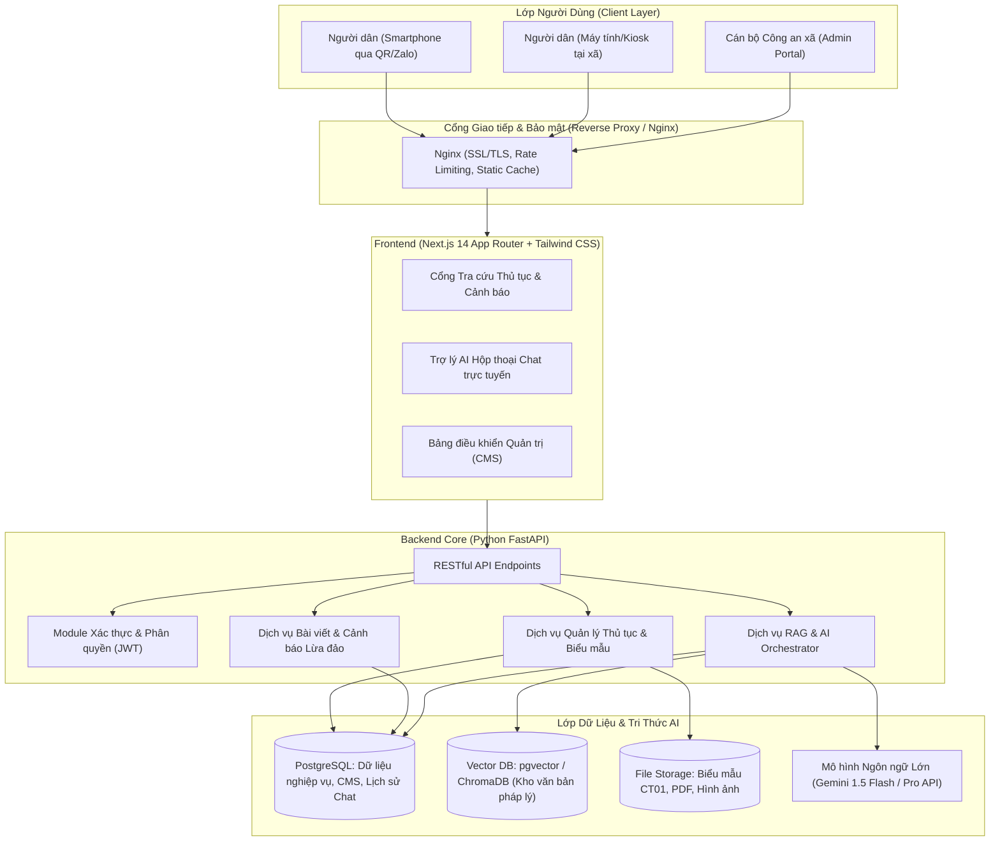
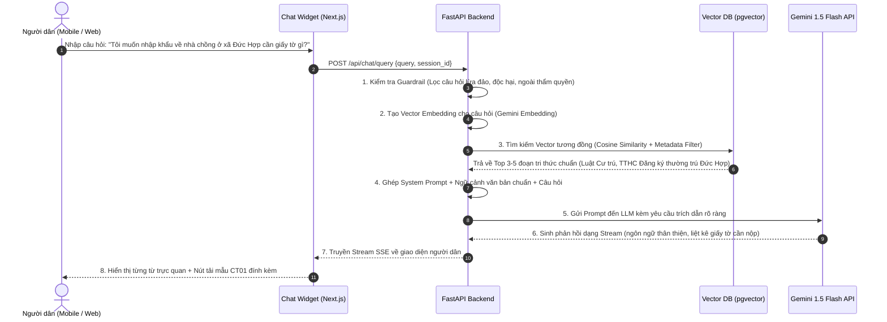

# KIẾN TRÚC KỸ THUẬT HỆ THỐNG (TECH ARCHITECTURE)
## DỰ ÁN: TRỢ LÝ PHÁP LUẬT VÀ THỦ TỤC HÀNH CHÍNH (CÔNG AN XÃ ĐỨC HỢP)

---

## 1. TỔNG QUAN KIẾN TRÚC (SYSTEM ARCHITECTURE OVERVIEW)

Hệ thống được thiết kế theo mô hình kiến trúc phân lớp hiện đại (**Decoupled Client-Server & RAG Microservice**), đảm bảo tính sẵn sàng cao, tối ưu cho trải nghiệm thiết bị di động (Mobile-First) và khả năng mở rộng từ phạm vi một xã (Đức Hợp) ra toàn huyện hoặc toàn tỉnh.

---

## 2. NGĂN XẾP CÔNG NGHỆ (TECH STACK SPECIFICATION)

| Thành phần | Công nghệ lựa chọn | Lý do lựa chọn |
|---|---|---|
| **Frontend Framework** | **Next.js 14+ (React 18/19, TypeScript)** | SSR/SSG tối ưu SEO, hiệu năng cao, cơ chế App Router dễ tổ chức route, hỗ trợ Streaming SSR cho Chatbot. |
| **Giao diện & UI** | **Tailwind CSS + Lucide Icons + Shadcn UI** | Nhẹ, dễ tùy biến giao diện thân thiện cho người già/bà con nông dân, tối ưu hoàn hảo cho màn hình điện thoại (Mobile-First). |
| **Backend Framework** | **Python FastAPI (Python 3.11+)** | Xử lý bất đồng bộ (async/await) cực nhanh, tích hợp sẵn Pydantic v2 để validate dữ liệu chặt chẽ, tối ưu cho xử lý AI và xử lý file PDF/Word. |
| **Cơ sở dữ liệu chính** | **PostgreSQL 16** (hoặc SQLite cho môi trường Dev) | CSDL quan hệ chuẩn mực, ổn định, hỗ trợ mở rộng lưu trữ bài viết, thủ tục, tài khoản cán bộ và thống kê. |
| **Cơ sở dữ liệu Vector** | **pgvector** (Postgres extension) hoặc **ChromaDB** | Lưu trữ Embeddings của tài liệu quy phạm pháp luật và hướng dẫn TTHC cấp xã, hỗ trợ tìm kiếm ngữ nghĩa (cosine similarity). |
| **Mô hình AI & LLM** | **Google Gemini 1.5 Flash / Pro API** | Tốc độ phản hồi cực nhanh (TTFT thấp), hỗ trợ tiếng Việt xuất sắc, chi phí hợp lý hoặc miễn phí hạn ngạch, cửa sổ ngữ cảnh lớn (Context window). |
| **Xử lý tài liệu (ETL)** | **LangChain / LlamaIndex + PyPDF / python-docx** | Trích xuất văn bản từ thông tư, hướng dẫn thủ tục của Bộ Công an, tự động chia nhỏ thành các đoạn thông tin (chunking) chuẩn ngữ nghĩa. |
| **Đóng gói & Triển khai** | **Docker & Docker Compose + Nginx** | Đóng gói một lệnh chạy ngay (`docker compose up -d`), dễ triển khai trên bất kỳ máy chủ VPS nào hoặc máy trạm tại Công an xã. |

---

## 3. THIẾT KẾ DỮ LIỆU (DATABASE SCHEMA)

### 3.1. Các bảng dữ liệu chính (PostgreSQL / SQLAlchemy)

1. **`categories` (Danh mục nghiệp vụ):**
   - `id`: UUID (Primary Key)
   - `code`: VARCHAR(50) (e.g. `cu_tru`, `can_cuoc`, `giao_thong`, `pccc`, `canh_bao`)
   - `name`: VARCHAR(255) (Tên hiển thị: Cư trú & Căn cước, Giao thông, v.v.)
   - `icon`: VARCHAR(100) (Icon Lucide)
   - `order_num`: INTEGER (Thứ tự hiển thị)

2. **`procedures` (Thủ tục hành chính):**
   - `id`: UUID (Primary Key)
   - `category_id`: UUID (Foreign Key -> categories.id)
   - `code`: VARCHAR(100) (Mã TTHC Bộ Công an)
   - `title`: VARCHAR(500) (Tên thủ tục: Đăng ký thường trú...)
   - `target_audience`: VARCHAR(255) (Đối tượng thực hiện: Công dân Việt Nam...)
   - `competent_authority`: VARCHAR(255) (Cơ quan có thẩm quyền: Công an xã Đức Hợp)
   - `required_documents`: JSONB/TEXT (Danh sách giấy tờ hồ sơ cần mang)
   - `steps`: JSONB (Trình tự thực hiện chi tiết từng bước)
   - `processing_time`: VARCHAR(100) (Ví dụ: 03 ngày làm việc)
   - `fee`: VARCHAR(255) (Ví dụ: 20.000 VNĐ hoặc Miễn phí)
   - `online_url`: VARCHAR(1000) (Link nộp trên Cổng DVC Bộ Công an / Cổng DVC Quốc gia)
   - `is_active`: BOOLEAN

3. **`forms` (Biểu mẫu tờ khai):**
   - `id`: UUID (Primary Key)
   - `procedure_id`: UUID (Liên kết với TTHC)
   - `form_code`: VARCHAR(100) (Ví dụ: Mẫu CT01, Mẫu ĐK xe)
   - `name`: VARCHAR(500) (Tờ khai thay đổi thông tin cư trú CT01)
   - `file_url`: VARCHAR(1000) (Đường dẫn tải file PDF/Word)
   - `guide_url`: VARCHAR(1000) (Tài liệu hướng dẫn cách điền mẫu)

4. **`articles` (Tin tức tuyên truyền & Cảnh báo lừa đảo):**
   - `id`: UUID (Primary Key)
   - `title`: VARCHAR(500)
   - `slug`: VARCHAR(500) (SEO-friendly)
   - `summary`: TEXT (Tóm tắt ngắn)
   - `content`: TEXT (Nội dung chi tiết - HTML/Markdown)
   - `image_url`: VARCHAR(1000) (Hình ảnh minh họa)
   - `category_id`: UUID
   - `is_scam_alert`: BOOLEAN (Đánh dấu bài cảnh báo lừa đảo khẩn cấp)
   - `scam_tricks`: JSONB (Các thủ đoạn nhận biết chính)
   - `prevention_advice`: JSONB (Lời khuyên phòng tránh của Công an xã)
   - `published_at`: TIMESTAMP
   - `views_count`: INTEGER

5. **`knowledge_chunks` (Lưu trữ Vector Embedding cho AI RAG):**
   - `id`: UUID (Primary Key)
   - `source_title`: VARCHAR(500) (Tên văn bản/nguồn tài liệu)
   - `source_type`: VARCHAR(50) (TTHC, Thông tư, Cảnh báo lừa đảo, Hỏi đáp)
   - `source_id`: UUID (Nullable - ID tham chiếu đến procedure/article)
   - `chunk_text`: TEXT (Đoạn nội dung văn bản)
   - `embedding`: VECTOR(768) (Vector embedding tạo từ Gemini Text-Embedding-004)
   - `metadata`: JSONB (Thông tin tham chiếu, điều khoản pháp lý, chương mục)

6. **`chat_logs` (Nhật ký hỏi đáp ẩn danh & Đánh giá):**
   - `id`: UUID (Primary Key)
   - `session_id`: VARCHAR(100) (ID phiên chat của người dân - ẩn danh)
   - `user_query`: TEXT (Nội dung câu hỏi)
   - `ai_response`: TEXT (Nội dung trả lời của AI)
   - `sources_cited`: JSONB (Các nguồn tài liệu được trích dẫn)
   - `feedback_rating`: SMALLINT (1: Hài lòng, -1: Chưa hiểu/Không hài lòng)
   - `feedback_comment`: TEXT (Ý kiến góp ý thêm)
   - `created_at`: TIMESTAMP

7. **`admin_users` (Tài khoản cán bộ quản trị):**
   - `id`: UUID
   - `username`: VARCHAR(100)
   - `password_hash`: VARCHAR(255)
   - `full_name`: VARCHAR(255) (Đ/c Cán bộ phụ trách)
   - `role`: VARCHAR(50) (`admin`, `editor`)
   - `is_active`: BOOLEAN

---

## 4. QUY TRÌNH RAG & AI PIPELINE (AI / RAG WORKFLOW)

### 4.1. Cấu hình System Prompt chuẩn cho Trợ lý Công an xã Đức Hợp
- **Vai trò:** Bạn là "Trợ lý số Pháp luật & Thủ tục hành chính của Công an xã Đức Hợp, huyện Kim Động, tỉnh Hưng Yên".
- **Đối tượng phục vụ:** Bà con nhân dân, người dân sinh sống hoặc liên hệ công tác tại xã Đức Hợp.
- **Phong cách:** Lịch sự, ân cần, xưng hô tôn trọng ("Tôi" và "Bác/Cô/Chú/Anh/Chị/Công dân"), giải thích rõ ràng, mạch lạc, dễ hiểu.
- **Quy tắc trích dẫn:** Luôn ghi rõ tên thủ tục, thời hạn giải quyết và biểu mẫu đi kèm.
- **Lời nhắc an toàn:** Nhắc nhở người dân "Thông tin mang tính chất hướng dẫn tham khảo; khi nộp hồ sơ xin vui lòng mang theo giấy tờ gốc để đối chiếu tại Trụ sở Công an xã Đức Hợp hoặc kiểm tra trên Cổng DVC Bộ Công an".

---

## 5. BẢO MẬT & BẢO VỆ DỮ LIỆU RIÊNG TƯ (SECURITY & PRIVACY)

1. **Bảo vệ quyền riêng tư công dân (Zero PII Retention):**
   - Người dân truy cập hoàn toàn ẩn danh.
   - Hệ thống không thu thập số CCCD, hình ảnh hay thông tin định danh cá nhân của người dân vào log chat.
   - Các câu hỏi được lưu trữ chỉ nhằm mục đích phân tích nhu cầu tìm hiểu pháp luật phổ biến để cải thiện nội dung tuyên truyền.
2. **Bảo mật cổng quản trị Cán bộ:**
   - Bảo mật mật khẩu bằng thuật toán Bcrypt / Argon2.
   - Xác thực token JWT có thời hạn ngắn (access token 60 phút, refresh token an toàn).
   - Rate limiting trên API (chống tấn công Brute-force và DDoS).
3. **Phòng chống tấn công Prompt Injection:**
   - Hệ thống lọc câu hỏi đầu vào (Sanitization); ngăn chặn các chỉ thị can thiệp vào hành vi hệ thống ("Ignore all previous instructions...").
   - Giới hạn độ dài câu hỏi tối đa 1.000 ký tự.

---

## 6. MÔ HÌNH ĐÓNG GÓI & TRIỂN KHAI (DEPLOYMENT ARCHITECTURE)

Dự án được cấu hình sẵn `docker-compose.yml` gồm 3 containers chính:

1. `web_frontend`: Ứng dụng Next.js (chạy Node.js 20 Alpine, expose port 3000).
2. `api_backend`: Ứng dụng Python FastAPI (chạy Uvicorn ASGI, expose port 8000).
3. `postgres_db`: Cơ sở dữ liệu PostgreSQL kèm pgvector (chạy port 5432, lưu trữ persistent volume).
4. `nginx_reverse_proxy`: Điều hướng `/` vào Frontend và `/api` vào Backend, quản lý chứng chỉ SSL Let's Encrypt tự động.
